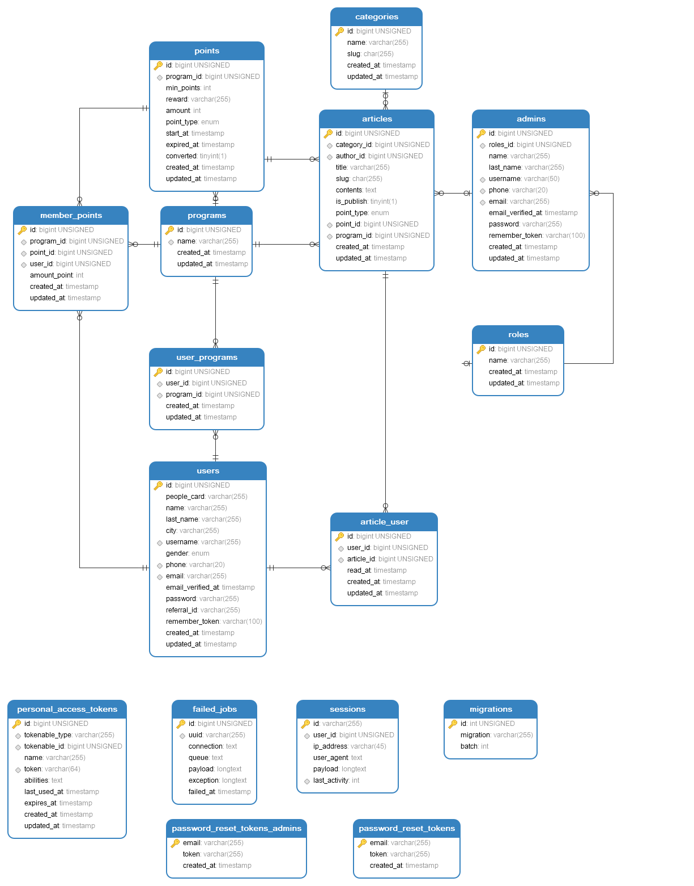
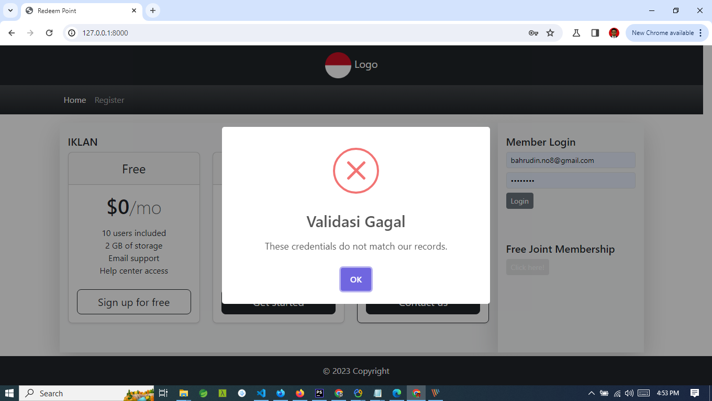
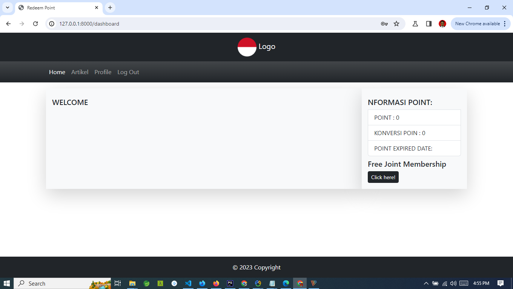
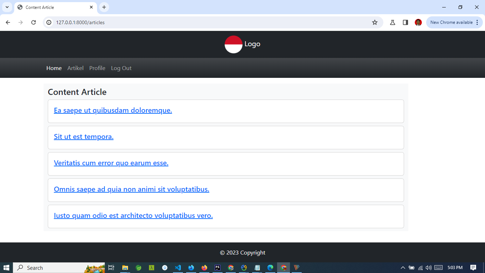
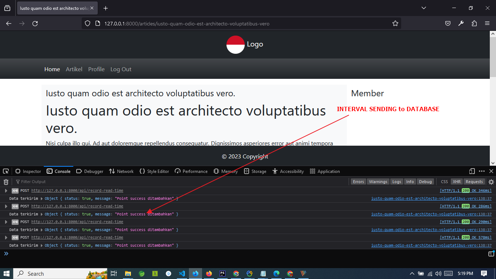
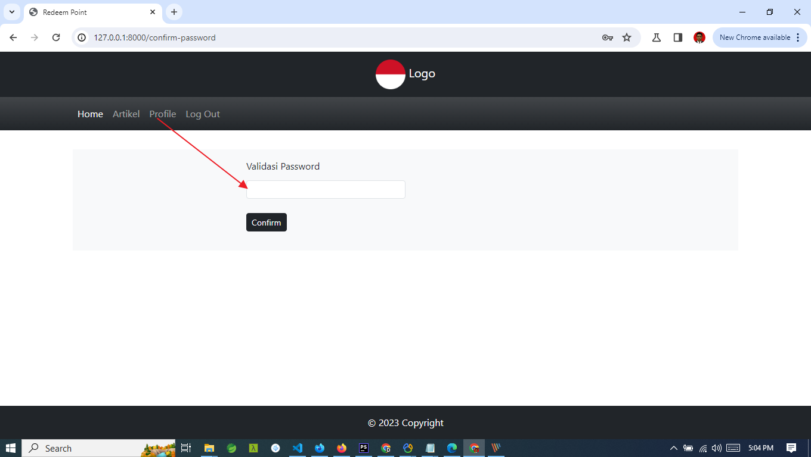
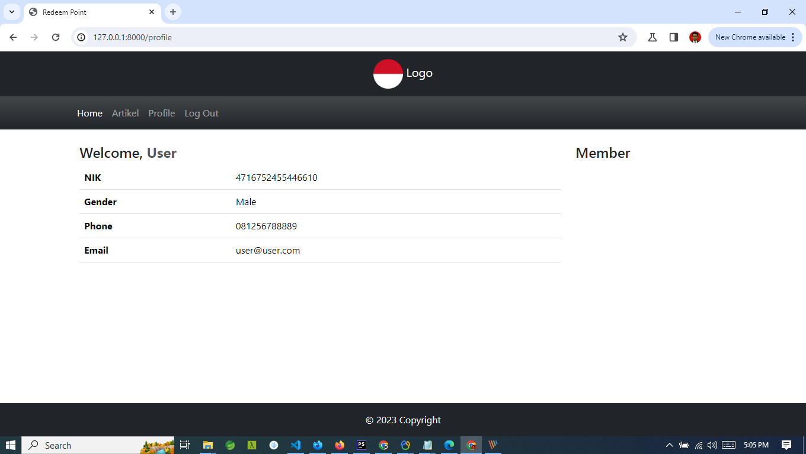
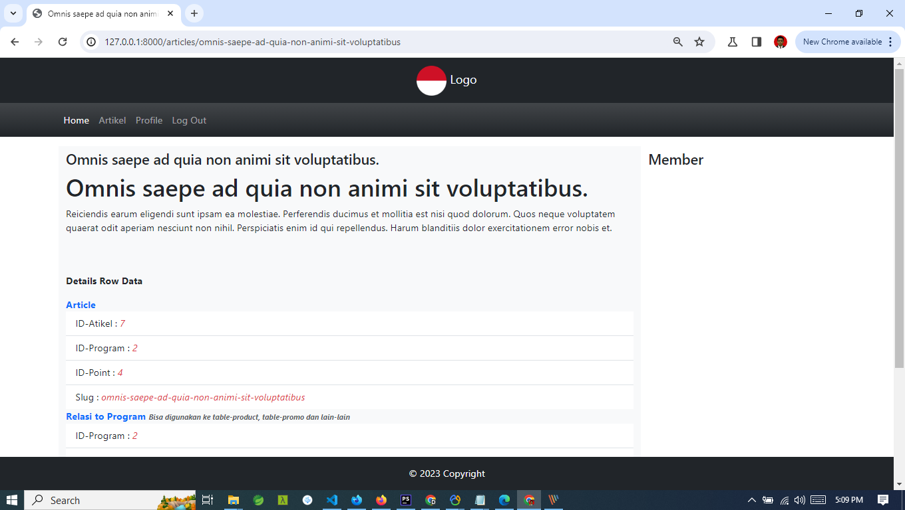

## ABOUT

Redeem Point For Program planing, etc

## APA YANG ADA ?

- **[Laravel 10.X](https://laravel.com/docs/10.x/releases)**
- **[Breeze](https://laravel.com/docs/10.x/starter-kits)**
- **[Boostrap V 5](https://getbootstrap.com/docs/5.3/getting-started/introduction/)**
- **[Vite JS](https://vitejs.dev/)**
- **[JQuery](https://www.jqueryscript.net/)**
- **[Sweetalert2](https://sweetalert2.github.io/)**

## Fitur

- Security Admin dan User
- Multi Guard Admin
- Otentikasi Email
- Interval Push for data automatic save database

## License

The Laravel framework is open-sourced software licensed under the [MIT license](https://opensource.org/licenses/MIT).

## UI

